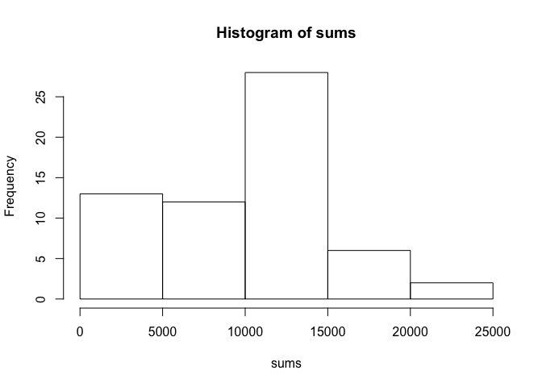
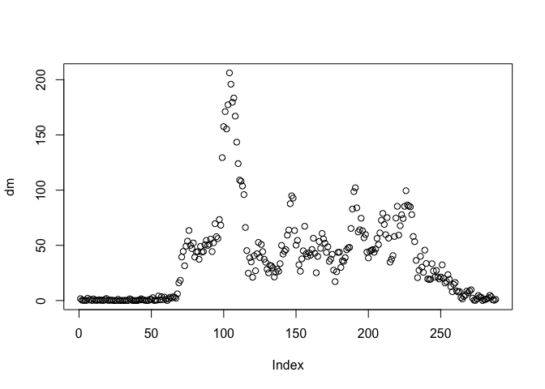
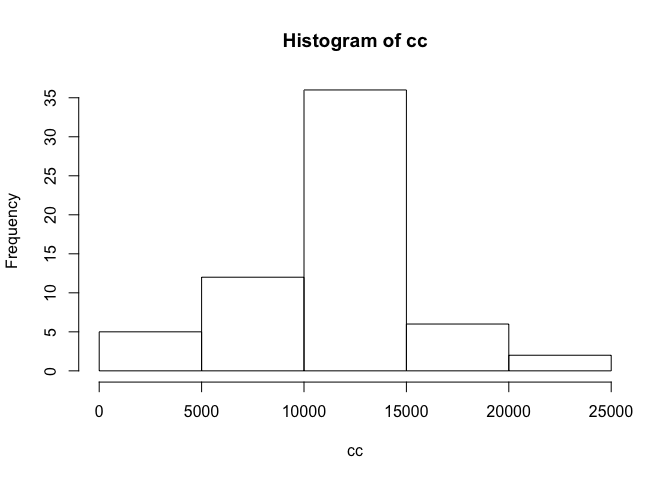
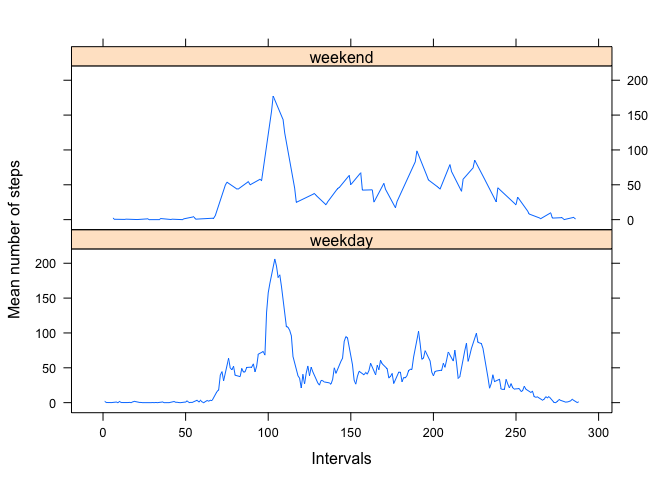

# Reproducible Research: Peer Assessment 1


## Loading and preprocessing the data

Loading the data:

```r
a <- read.csv("activity.csv")
head(a)
```

```
##   steps       date interval
## 1    NA 2012-10-01        0
## 2    NA 2012-10-01        5
## 3    NA 2012-10-01       10
## 4    NA 2012-10-01       15
## 5    NA 2012-10-01       20
## 6    NA 2012-10-01       25
```

Split measurements by date:

```r
s <- split(a$steps, list(a$date))
```


## What is mean total number of steps taken per day?

Calculate total number of steps per day:

```r
sums <- sapply(s, sum, na.rm=T)
```

Plot a histogram of total number of steps taken each day:

```r
hist(sums)
```



Mean and median amount of steps per day:

```r
mean(sums)
```

```
## [1] 9354.23
```

```r
median(sums)
```

```
## [1] 10395
```


## What is the average daily activity pattern?

Split the data by interval now:

```r
d <- split(a$steps,list(a$interval))
```

Plot the mean number of steps per interval:

```r
dm <- sapply(d,mean,na.rm=T)
plot(dm)
```



Which interval has the maximum number of steps on average?

```r
which.max(dm)
```

```
## 835 
## 104
```


## Imputing missing values

Calculate the number of all NAs:

```r
n <- is.na(a$steps)
sum(n)
```

```
## [1] 2304
```

Substitute NAs with interval means:

```r
df <- data.frame(matrix(unlist(d), nrow=288, byrow=T))
dm <- as.matrix(df)
k <- which(is.na(dm), arr.ind=T)
dm[k]<- rowMeans(dm,na.rm=T)[k[,1]]
```

Plot a histogram of total number of steps each day with substituted NAs:

```r
cc <- colSums(dm)
hist(cc)
```



Mean and median total number of steps per day:

```r
mean(cc)
```

```
## [1] 10766.19
```

```r
median(cc)
```

```
## [1] 10766.19
```

Inputing missing values led to same mean and median of the distribution and the distribution itself became more similar to normal.

## Are there differences in activity patterns between weekdays and weekends?

Create a new column in the original data with the names of weekdays:

```r
days <- weekdays(as.Date(a$date))
a[,"days"] <- days
```

Split intervals by days and make a list with the weekday names for each day of measurements:

```r
dayNames <- split(a$days, list(a$date))
newDays <- lapply(dayNames, "[[", 1)
```

Replace column names in the matrix with substituted NAs (columns are days, rows are intervals):

```r
colnames(dm) <- newDays
```

Manually change the levels of the factor with days names by "weekend" and "weekdays":

```r
fDays <- as.factor(colnames(dm))
levels(fDays) <- c("weekday","weekday","weekday", "weekday", "weekday", "weekend","weekend")
colnames(dm) <- fDays
```

Plot the mean number of steps for weekends and weekdays separately, for this transform the data matrix to the data frame first:

```r
dmf <- as.data.frame(dm)
library(lattice)
xyplot(rowMeans(dmf) ~ as.numeric(rownames(dmf)) | factor(colnames(dmf)), type = "l", xlab = "Intervals", ylab = "Mean number of steps", layout = c(1,2))
```


